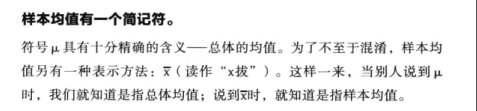
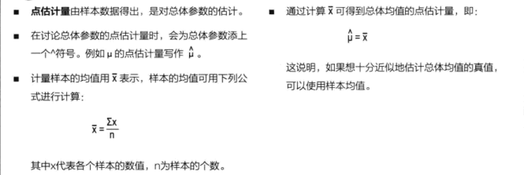
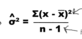
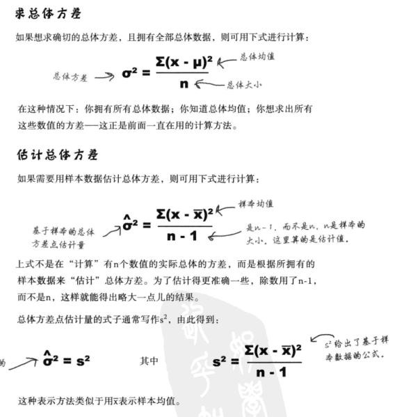
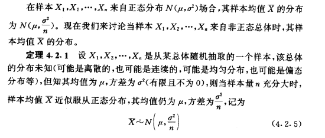

<h2>总体和样本的估计</h2>

<h3>通过样本估计总体<h3>

即点估计量可以近似总体参数。一个总体参数的点估计量就是可用于总体参数值的某个函数或算式。

* 样本均值
  
 

  由于可以用样本均值估计总体均值。

* 估计总体的均值
 
 

<h3>估计总体的方差</h3>

样本数据的方差可能不是总体方差的最好估计办法，主要原因也就是在于：
* 相比总体，样本数据中量变化少，与总体中的数据偏离均值相比，样本数据更有可能以更紧密的方式聚集在均值周围，所以需要进行修正。
* 用样本方差估计总体方差会出现这样的问题：估计结果会稍微偏低。样本方差可能会略小于总体方差，差别程度取决于样本数值的大小。
* 样本较小时，样本方差与总体方差的差别有可能更大。
  
具体的做法：通过除以 n – 1来适当的提高方差的大小。样本方差的计算方法： 

**具体的推理过程**

<h3>通过总体估计样本</h3>

也就是比例抽样分布，抽样分布，指样本估计量的分布。
以样本平均数为例，它是总体平均数的一个估计量，如果按照相同的样本容量，相同的抽样方式，反复地抽取样本，每次可以计算一个平均数，所有可能样本的平均数所形成的分布，
就是样本平均数的抽样分布。
无论是重复抽样还是不重复抽样，样本比例p的数学期望总是等于总体比例P。
比例的抽样分布其实是一种概率分布，由所有大小为n的可能样本的各种比例构成。如果知道这些比例的分布，就能用这个分布求出一个特定样本比例发生的概率，记为PS 分布。

* 利用所有可能的样本，能得出所有样本比例的分布，该分布称为比例抽样分布。
* 利用比例的抽样分布能够求出一个随机选择的，大小为n的样本的“成功比例”的概率。

比例抽样分布的期望和方差

* 随机变量 * 对应的概率。
  
  