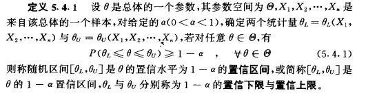
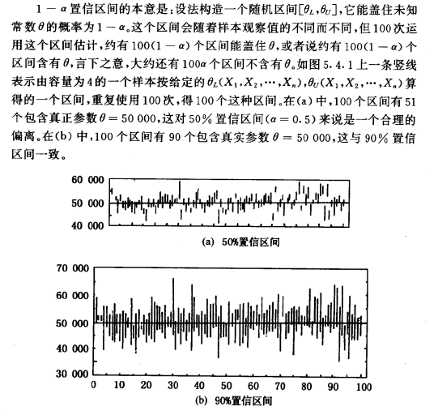
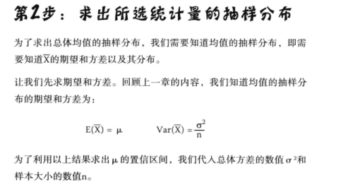
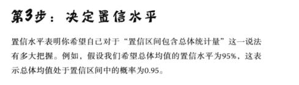

<h2>置信区间的构建</h2>

仅仅依靠一个样本对总体做出的假设，如果样本出现了问题，那么就会造成错误的估计。这里提出另一种总体统计量的方法，一种考虑不确定性的方法，即 置信区间。
样本能够百分百的代表总体，对于这点没有准确的把握，原因很简单 – 用的是样本,
点估计量是有价值的，但也许存在小小的误差。

* 认识置信区间
  参数的估计有两种形式，点估计值给人一个明确的数量，未知参数是多少，但不能给出精度。为了弥补这种不足，提出区间估计的概念。点估计与区间估计是相互弥补，各有各的用途。

  
  

  <h3>构建置信区间的方法</h3>

  
  
  
  