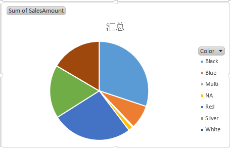
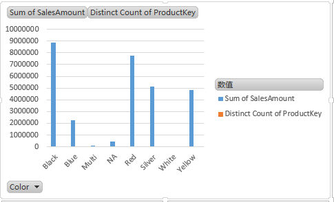
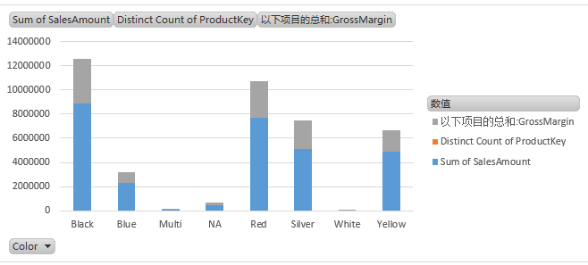
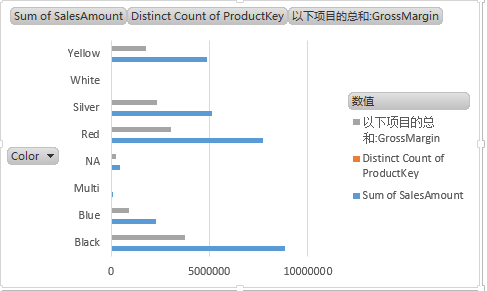
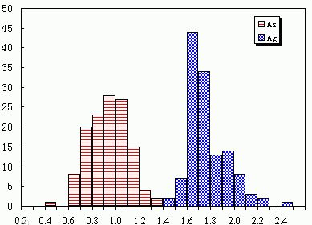
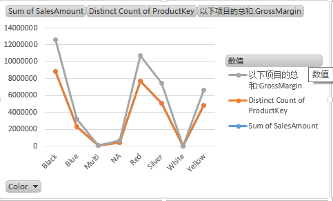
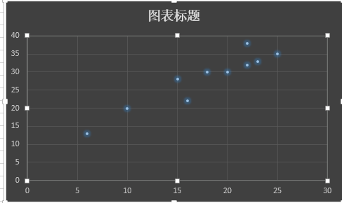

<h2>数据图表的使用</h2>

<h3>1 总体</h3>
不同的图表形式，揭示出不同的数据信息。但也同时也可能误导读者，或隐藏重要的信息，通过对不同的图表进行说明，能够更好的进行展示数据。能够搞好的理解数据意义，揭示深层次的问题

<h3>2 概念及注意事项<h3>

* 数据
  没有意义的数字。如 1 ， 2 ，100。

* 信息
  赋予意义的数字，可以表示对象的某种属性特征，1米长的桌子。

 * 频数
  表示一个特定组，或者说一个特定区间内的统计对象的数目，类似于数数。一种统计方法，用于描述一个类别中有多少个项。

* 类别数据（定性数据）
  数据被划分为各种类别，用以描述某类的性质户特征，因此也称为定性数据。对于类别数据不要将其理解为数字。（如甜品的种类）。

* 数值数据（定量数据）
  数值型数据具有数字的意义，还涉及计量或计数（如长度和时间）。

<h3>3 图标类别</h3>

* 饼图
  * 表述意义
    基本比例进行比较，每个扇形大小展示的每组数据的相对频数，通过比较能交容易的看出哪个组具有较高的频数.

    

  * 使用场景
    整体和部分的关系，各分组间的比例有较大的差异性，能够较容易的识别出。但扇形大小相似时不适用；当扇形块所占整体比例无关的百分数时，则意义不大。

* 条形图
  * 表述意义
    能够精确的表示出各类别的关系，可以分成垂直的和水平的。主要还是体现类别间的差异。

    

  * 使用场景
    进行对不同的类型的数据进行准确的比较，并可以比较不同的类别数据间的差异。

* 堆积条形图
  * 表述意义
    在一张图形上展示多批数据，每批数据也都是使用一组条形图进行标识，可以使用不同的延时来表明不同的批次的数据。

    

  * 使用场景
    需要进行准确的表示多批的数据。每批数据是不同批次数据的不同的属性。

* 分段条形图
  * 在一张图形上展示多批数据，但是多批的数据，在一个条形图上进行形式。使用不同的颜色进行显示，对于这些的数据最好是某个数据属性的上数据。
  
  

  * 使用场景
    需要进行准确的表示多批的数据。每批数据可以是不同批次数据的不同的属性。但最好是相同的数据，这样更能直观的将数据信息表达。

* 直方图
  * 表述意义
  用于处理分组数据。可以用来体现不同分组间每个数据的区间。又可以体现出频数的关系。

  

  * 使用场景
  需要进行对分组数据进行展示的时候。对于分组数据中的每个区间的面积和其频数成正比。所以这里出现的一个概念有就是频数密度。

* 折线图
  * 表述意义
  可以用来体现趋势，对多批数据进行显示，每批数据使用一条线段表示。可以用折线进行基本的预测。对于折线图是由绘制出的各个点连接起来得到的。使用折线图来表示类别数据是没有意义的。

  

  * 使用场景
    需要信息基本的数据预测时。

* 散点图
* 表述意义
  可以用来体现趋势，对多批数据进行显示，每批数据使用一条线段表示。

  

* 其他 
  * 如箱线图， 雷达图等。
  

<h3>4 注意</h3>

*   若只有百分数而没有频数，或只有频数没有百分数，这样的图表数据需要小心。由于其无法准确的体现出数据的真实情况。
*   不要使用折线图来表示类别数据，除非使用每一个类别趋势，使用基于时间的趋势。
