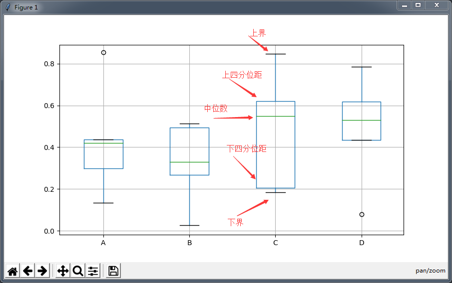

<h2>方差使用和数据分散性</h2>

数据间的各种距离，可达到计算数据的分散性和变异性。变异性提供了对一个分布中的数据分散开或聚集在一起的程度的数量测量。
对于均值，中位数，众数单纯的指出数据的中心，但是这样还是不够，并没有的整体的指出的数据频率的情况及稳定性。

<h3>数据分散性</h3>

<h4>全距</h4>

通过计算全局，可以获取数据的分散情况。全局值数据的分散范围，是数据的跨度。

<font color="Hotpink">计算的方法为：数据集中的最大值减去数据集中的最小值。</font>

<h4>上届和下届</h4>
<font color="Hotpink"> 计最大值称为上界;最小值称为下界 </font>

<h4>异常值对全距的影响</h4>

对于将数据进行排序，在数据的两端的值中可能包含异常时，于是全距的值将会受到影响。由于全距的计算中及其的简单，所以无法很好的进行对数据的分散性进行分析（主要受异常值的影响）。

<h4>四分位距</h4>

为了消除异常值中对全距的影响，可以使用四分位距剔除异常值。四分位距的计算方法
    * 1 对整份数据进行排序，从小到大进行排序  
    * 2 数据进行4等分，即每一份的数据为包含4分之一的数据
    * 3	求取上下四分位距的值和四分位距，求取中位数

* 第一四分位数 (Q1)
又称“较小四分位数”，等于该样本中所有数值由小到大排列后第25%的数字。
* 第二四分位数 (Q2)，又称“中位数”
等于该样本中所有数值由小到大排列后第50%的数字。
* 第三四分位数 (Q3)
又称“较大四分位数”，等于该样本中所有数值由小到大排列后第75%的数字。
* 四分位距
第三四分位数与第一四分位数的差距又称四分位距（InterQuartile Range,IQR）

* 示例图：

```
| 1  2  3  4  | 5  6  7  8 | 9  10  11  12 | 13  14  15  16 |

              Q1           Q2              Q3  

```
* 算法
 * 求解下四分位距 - 求下四分位距的位置
    * 1 计算 n / 4 
    * 2 如果为整数，则取四分位距位于 n / 4 这个位置和下一个位置的中间，取两个位置上的数值的平均值，即 **下四分位距**
    * 3 如果 n / 4 不是整数，则向上取整，所得结果即为 **下四分位距**。
     
 * 求解上四分位距 - 上四分位距的位置
   * 1 首先计算 3n / 4 
   * 2 如果为整数，则取四分位距位于 3n / 4 这个位置和下一个位置的中间，取两个位置上的数值的平均值，即 **上四分位距**
   * 3 如果 3n / 4 不是整数，则向上取整，所得结果即为 **上四分位距**。

 * 求解四分位距
   上四分位距 - 下四分位距 ; 使用Q3计算得到的数减去 Q1处计算得到的数， 即Q3 – Q1 。

 目前可以使用，各种编程语言下的相关库进行计算四分位距，python中使用matplotlib得到的箱线图（图中的圆点表示的是异常值）
 


<h3>数据的变异性</h3>

通过数据的全距和四分位距得到数据的分散性，这样也就是可以反应出一些稳定性。但是还是不够，虽然是已经整体上对数据进行了分析，但是无法体现出数据的频率，
以及对数据变异程度的分析，数据距离数据中心的情况。

<h4>使用方差</h4>
方差衡量随机变量或一组数据时离散程度的度量，概率论中方差用来度量随机变量和其数学期望（即均值）之间的偏离程度。在计算方差中，一个较为重要的计算量是均值（μ）
计算方法：

* 1 求平均值

$$
\mu = \frac{\sum_{i=1}^{n}{x}}{n}
$$

* 2 求平均距  
即各个值到均值的距离的和的平均值，每个值和均值的差计算得到的结果是可正可负的，这样会出现抵消作用，导致平均值的计算不准确。

* 3 求平均距的平方和 即方差σ
针对在上述中的问题，为了消除抵消的效果，将每个值和均值的差值进行平方和的平均值，于是这样就得到了 方差 使用符号 

$$
σ^2 = \frac{ \sum_{i=1}^{n}{ ( x-μ  ) ^2 } }{n}
$$

简化公式：
$$
σ^2 = \frac{\sum_{i=1}^{n}{x^2 }}{n} - μ^2
$$

标准差：
$$
σ  = \sqrt{ \frac{ \sum_{i=1}^{n}{ ( x-μ  ) ^2 } }{n} }
$$

<h4>计算标准分</h4>
也叫z分数，是一种具有相等单位的量数。
对于不同的数据集间的比较，如何比较它们将的稳定性，对于在这样的情况下进行比较数据是，由于数据集间的均值和标准差都不相同，需要进行一次的装换将它们转化为在相同的情况下。
它是一个抽象值，不受原始测量单位的影响，并可接受进一步的统计处理。对于标准分的计算的方法为:

$$
z = \frac{x - μ}{\sigma}
$$

* 对于 markdown math 的相关标记：
  * \frac{}{}  -            用来表述除法
  * \sum_{i=1}^{n}{expr}    用来表示汇总值
  * \mu                     表示希腊字母μ
  * \sigma                  表示希腊字母σ 	
  * \sqrt{}                 计算平方根
  * n^2                     计算平方
