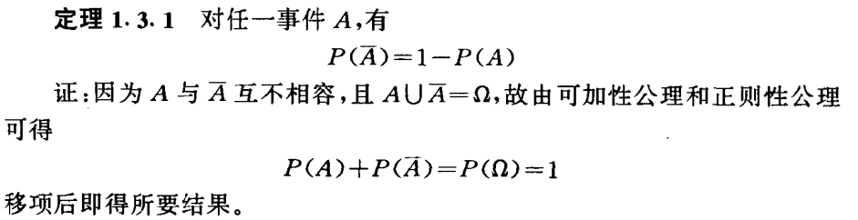
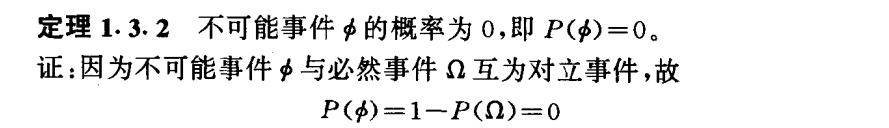
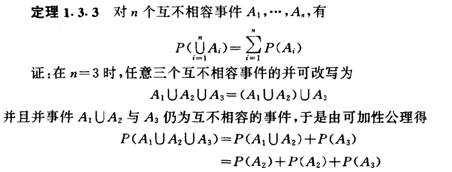
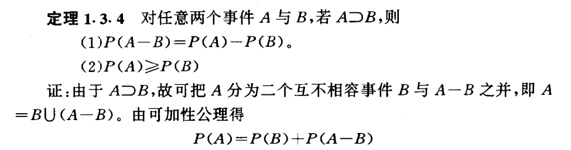
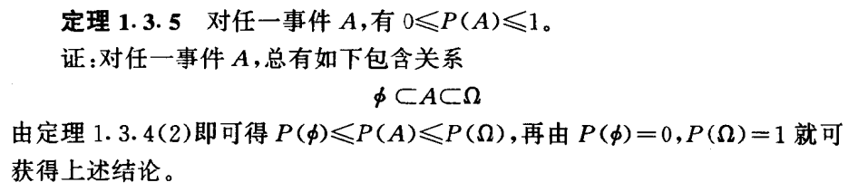
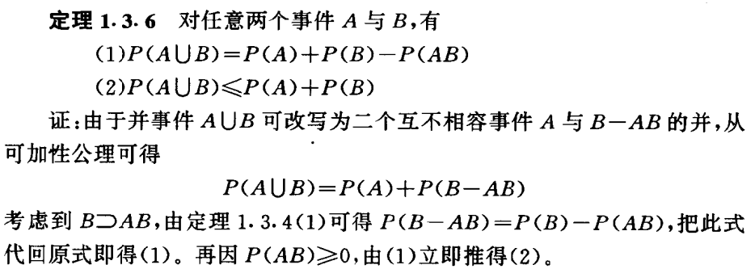
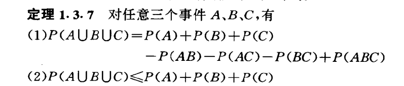

<h2>概率计算</h2>

<h3>相关概念</h3>

* 随机现象：在一定条件下，并不总是出现相同结果的现象。
* 随机试验：可以重复的随机现象。
* 基本结果：随机现象最简单的结果，是统计中的抽样的基本单元，故也称为样本点。
* 基本空间：随机现象所有基本结果的全体。
* 随机事件：某些基本结果组成的集合称为随机事件。
* 必然事件和不可能事件：一定会发生的时间和不可能发生的事件。
* 维恩图：可以用来表示在基本空间中的事件关系的椭圆形图，较直观。

* 事件的包含关系：
    事件A的任意结果都在事件B中，B包含A，使用符号 A⊂B，注意开口方向。

  $$
    A \subset B 
  $$

* 事件相等 : 事件A中的任意结果都在B中，而B中的任意结果也都在A中 A = B
* 事件互斥 : 事件A和B没有相同的结果

**事件的计算**
* 对立事件 : 不在A中的一切基本结果称为事件A的对立事件，在事件A上加一条横线。 二者相加为1

  $$
  \overline{x}
  $$

* 事件A与B的并： A ∪ B
* 事件A与B的交： A ∩ B
* 事件A与B的差：在事件A中而不在事件B中的基本结果 B – A

<h3>事件的概率计算</h3>

* P(A) = 事件A发生中的基本结果个数 / 基本空间中的所有基本结果的个数 。
* 在进行求解概率的过程中 使用维恩图能够更高的进行理解。
* 在计算概率中多使用到排列组合进行计算基本事件的个数，所以对于排列中应该进行

<h3>概率计算中的相关的公式</h3>

相关内容摘录： 概率与数理统计（茆诗松 周纪芗）

* 概率计算中的相关定理和性质:

* 1 
  

* 2 
  

* 3 
  

* 4 
  

* 5 
  

* 6 
  

* 7 
  

