<h2>5条件概率和贝叶斯公式</h2>

通过对事件的独立性的判断，可以计算条件概率；条件概率是贝叶斯公式推导的重要部分。所以对于事件的独立性判断和条件性的判断很重要的。

```
Tip
1 P(AB) 即为 P(A∩B) 表示的是两个事件的交集，针对条件概率。
2 事件A的概率 P(A) 和 事件A的条件概率 P(A|B) 都是表示A的概率，这点需要明确。
3 对立事件和互斥事件: 事件A和事件B为对立事件，只有一个事件能发生P(A)+P(B)=1；对立事件，不同时发生,P(A) + P(B) < 1
```

<h3>相关概念</h3>

* 事件独立性
  两个事件间的独立性是指一个事件的发生不影响另一个事件的发生。事件A和事件B中 P(AB) 表示的是事件A和事件B同时发生时的概率计算。
  如果P(AB) = P(A)P(B)则表示 事件A和事件B是独立的,所以对于事件将的独立性的判断依据可以根据这个来。

  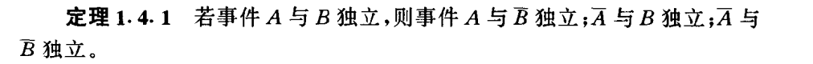

* 贝努里实验
  只有两个结果的试验。

<h3>条件概率</h3>

事件A和事件B是基本空间中的两个事件，且 P(B) > 0,在事件B已发生的条件下，事件A的发生的概率为P(A|B)  即 P(A|B) =  P(A∩B)/P(B)。 
记: P(AB) = P(A∩B)

使用符号|来进行标识，对于这里的 A|B 中向后顺序表示的在那个事件的发生的条件下，表示的是在右边，即右边事件发生的条件下。

  * 条件概率的性质:

  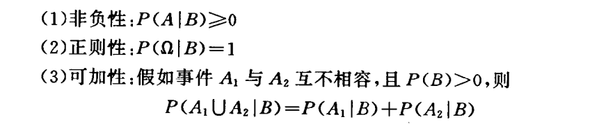

  * 条件概率相关定理
    * 1 这个在推导贝叶斯公式时会使用到

  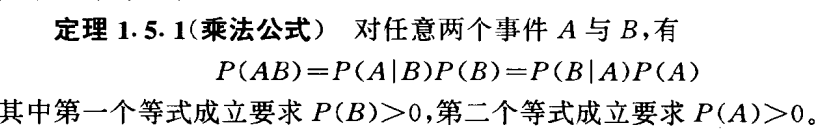

    * 2 
  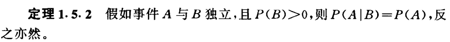

    * 3 
  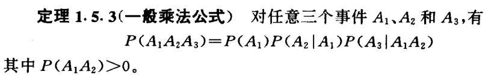

<h3>全概率公式</h3>
设A和B是任意二个事件，假如 0 < P(B) < 1 则：P(A) = P(A|B)P(B) + P(A|-B)P(-B)
推导过程:

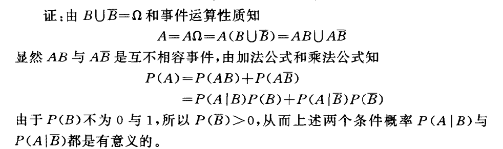

**对于全概率公式中的相关的定理**

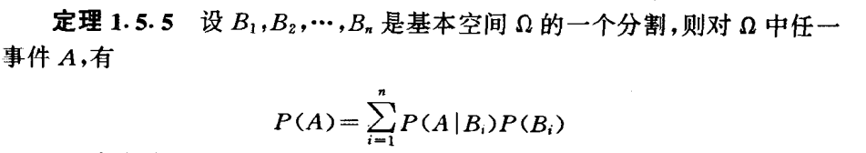

<h3>例</h3>
贝叶斯公式在 条件概率公式和全概率公式下进行推导，进行一次的推导的过程的说明。贝叶斯的统计学中有一个基本的工具叫贝叶斯公式、
也称为贝叶斯法则， 尽管它是一个数学公式，但其原理毋需数字也可明了。如果你看到一个人总是做一些好事，则那个人多半会是一个好人。
这就是说，当你不能准确知悉一个事物的本质时，你可以依靠与事物特定本质相关的事件出现的多少去判断其本质属性的概率（这里的形容很好）。
**用数学语言表达就是：支持某项属性的事件发生得愈多，则该属性成立的可能性就愈大。**

是概率统计中的应用所观察到的现象对有关概率分布的主观判断（即先验概率）进行修正的标准方法。

* 逆条件概率概率的方法
    需要求出条件概率的情况下，且该条件概率与已知条件概率顺序相反时使用。这里提出了两个概率：条件概率和先验概率。
    有两个条件概率，通过一个条件概率来求另一个条件概率的过程，期间还需要计算其他的概率代入到公式进行求解。
在期间涉及到求解条件概率的过程，期间用到先验概率，这两个概率都是表示同一个事件的概率，只是表示的是在不同的条件情形下进行的计算。

* 关于贝叶斯公式（先从最基本的两个来推导）
    * 条件概率公式

    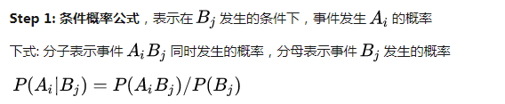
    * 使用条件概率下的 乘法公式 代入进行变换（定理1.5.1） 

    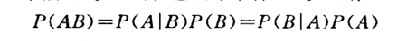

    代入上述的条件概率公式：
	P(AB)  =  P(A|B) * P(B)  =  P(B|A) * P(A) 
    通过这一步可以发现将条件概率转换了，由原来的P(A|B)换成了P(B|A),并且把先验概率的同时代入了P(A)和P(B)。
    所以可以得到 P(A|B)  =  P(B|A) * P(A)  /  P(B)  在求解中重新引入了对立的条件概率，并且将两个事件的先验概率代入。

    * 对于P(B)使用全概率公式代入

    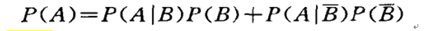

    P(B) = P(B|A)*P(A) + P(B|-A)*P(-A)
    于是得到贝叶斯公式,发现通过一个条件概率求解器相反的条件概率，期间需要使用P(A)即先验概率。所以通过贝叶斯公式可以用来进行验证，预测作用，针对在只知道相关条件概率和先验概率的情况进行求解。
    P(A|B) = P(B|A) * P(A) / P(B|A)*P(A) + P(B|-A)*P(-A)。结合使用定理1.5.5 可以得到贝叶斯公式的一般形式

    贝叶斯公式的一般形式：
    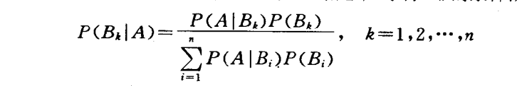

    一个较为好理解的推导过程
    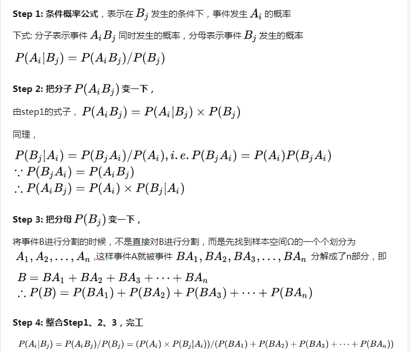

 * 对于贝叶斯公式的使用相关辅助方法
    使用概率树，针对条件概率下，针对不同的条件，延伸出不同的条件分支，进行求解概率。以概率树的方式其方式和决策树很像。所以就是又有了决策树的概念在这里。
    * 针对贝叶斯公式中的求解针对的情况和场景：
    * 是概率统计中的应用所观察到的现象对有关概率分布的主观判断（即先验概率）进行修正的标准方法。从整个观念上来说，其有一个对先验概率的验证的作用。
    * 不断的用后验概率来验证先验概率
    * 需要求出条件概率的情况下，且该条件概率与已知条件概率顺序相反时使用。

    在运用概率对某一事件进行推断之前，我们往往已经事先掌握了关于这一事件的概率，这个概率可能是主观概率或者相对概率，
这种初始的概率可以称为先验概率。如果在后续的研究中，通过抽样调查样本等消息源又获得了有关该事件的信息，我们就可以根据这些


