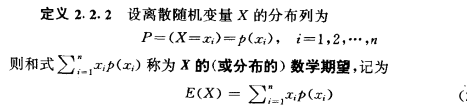
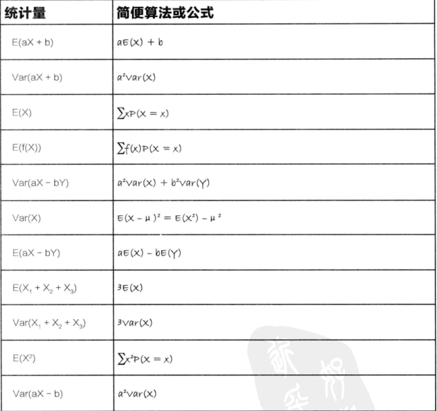

<h2>随机变量和概率分布</h2>

相关定理内容摘录： 概率与数理统计（茆诗松 周纪芗）

<h3>相关概念</h3>

* 随机变量
假设一个变量在数轴上的取值依赖于随机现象的基本结果，则此变量为随机变量，可以用大写字母X，Y，Z来表示。

* 离散性随机变量
如一个随机变量仅取值数轴上有限或可孤立点，则这个随机变量为**离散随机变量**

* 连续随机变量
假如一个随机变量的可能取值充满数轴上的一个区间（a,b）,则此随机变量为**连续随机变量**

<h3>随机变量的概率分布</h3>
对于概率分布这个概念，一个随机变量的值会对应一个概率。这所有的随机变量的值和其对一个的概率构建一个概率分布图，即得到了概率分布。

* 数学期望
数学期望(mean)（或均值，亦简称期望）是试验中每次可能结果的概率乘以其结果的总和。 即 随机变量 乘以 对应的概率值的和。
数学期望 指用概率分布算得的一种加权平均，是概率论中的一个基本概念,期望指示预测结果。

$$
E(x)= \sum_{i=1}^{oo}{x_i} * p_i
$$

   * 相关定义：

对于期望揭示 每次试验中期望得到的平均结果。但是对于单纯的使用期望值，并没有体现出期望结果的变化情况，并没有体现出期望的分散性和变异性。
对于在概率分布中引入方差的内容，以达到对试验数据更全面，正确的分析。

<h3>方差和概率分布</h3>
求期望（概率分布）的方差的方法，对于有一般的方法，也有针对特殊模型有特别的求解方法，同时还要注意区分概率分布的类型是离散型的还是连续性的。

* 期望的求解公式:
E(X) = ∑xP(X=x) 

* 对于求解方差的方法时，将上述的公式代入。
Var(X) = E(x-μ)2
Var(X) = ∑(x-μ)2  *  P(X=x)  /  n

* 随机变量的线性变换对应的期望和方差的求解
对随机变量进行线性变换。如随机变量X进行了线性的变化 ， 变成了 aX + b 。对于线性变换后的期望和方差的求解。

