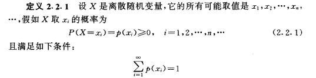
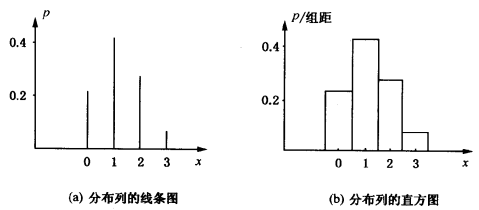
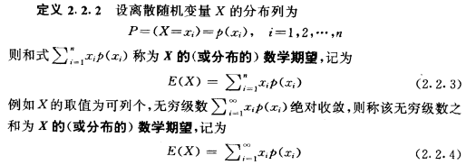

<h2>离散型随机变量</h2>

相关定理内容摘录： 概率与数理统计（茆诗松 周纪芗）

<h3>相关概念</h3>

* 分布列：表示概率在所有的可能发生的情况中的分布。

|事件|A|B|C|D|
|-|-|-|-|-|
|P|0.15|0.1|0.5|0.25|

A,B,C,D 分别表示四个不同的事件， P 为他们对应的概率，（0≤p≤1）对于任意一个分布列，所有概率之和为1，也可记为100%。

<h3>离散型随机变量及其分布列</h3>
离散型（discrete）随机变量即在一定区间内变量取值为有限个或可数个。例如某地区某年人口的出生数、死亡数，某药治疗某病病人的有效数、无效数等。
离散型随机变量通常依据概率质量函数分类，主要分为：伯努利随机变量、二项随机变量、几何随机变量和泊松随机变量。

* 定义1
如果随机变量X只可能取有限个或至多可列个值，则称X为离散型随机变量。

* 定义2
设X为离散型随机变量，它的一切可能取值为X1，X2，……，Xn，……，记P=P{X=xn},n=1,2...称上式为X的概率函数，又称为X的概率分布，简称分布。

对于分布列有两种表示方法：线条图与直方图

<h3>离散型随机变量的数学期望</h3>

<h3>常用的离散型分布模型</h3>

* 二项分布
进行一系列次数有限的独立试验，每一次试验或成功或失败，每一次试验的成功概率相同。主要的目: 在n次试验中能成功多少次。
设每次试验中的概率为p，q = 1 – p ；其数学期望为E = np；方差为 Var(x) = npq。当 n 很大，但p很小时，二项分布可以用泊松分布来进行替代。

* 泊松分布
单个事件在给定区间内随机，独立发生，已知给定区间内事件平均发生次数或者叫发生率，且这个发生次数或发生率是有限的，主要目的：给定区间内事件发生次数。用λ表示发生率, λ表示发生率，
在特定的区间内的平均发生次数。对于泊松分布的期望 E(X) = λ ， 且Var(X) = λ

* 几何分布
行一系列独立试验，每一次试验或成功或失败，每一次的成功概率相同。主要目的: 为了取得一次成功需要试验的次数。
设每次试验中的概率为p , 且 q = 1-p ;其数学期望为E = 1 / p ;方差为 Var(x) = q / p2
