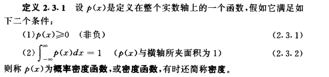
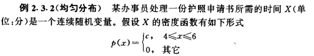
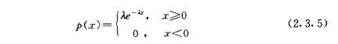
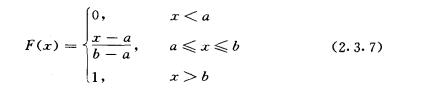
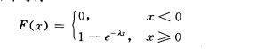
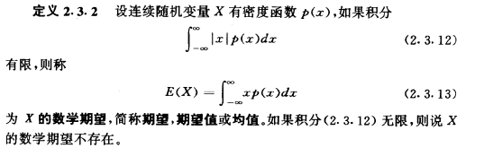
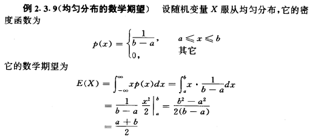
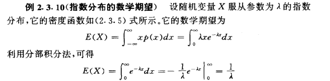
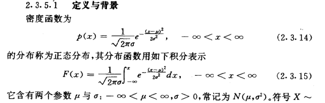
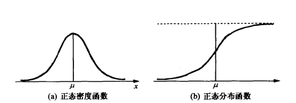

<h2>连续型随机变量</h2>

相关定理内容摘录： 概率与数理统计（茆诗松 周纪芗）

对于随机变量并不是只有离散型的，还有连续型的随机变量，对于连续型的随机变量有着和离散型随机变量完全不同求解期望和方差的方法。

连续型随机变量是指如果随机变量X的所有可能取值不可以逐个列举出来，而是取数轴上某一区间内的任一点的随机变量。
例如，一批电子元件的寿命、实际中常遇到的测量误差等都是连续型随机变量

<h3>相关概念</h3>
* 概率密度函数：通过定义数据公式发现是一个积分的操作。
* 概率的值为通过概率密度函数绘制出的图形的面积。所以为了求解概率，先求解概率密度函数

对于连续型随机变量的数学定义：

* 针对的不同随机分布

    * 均值分布
    

    * 指数分布
    如下指数函数表示的密度函数:
    

* 不同随机变量函数的概率密度函数表示
    * 均匀分布的分布函数（概率密度函数）
    

    * 指数函数的分布函数
    

<h3>连续型随机变量的数学期望</h3>
相关定义：

   * 均匀分布的数学期望
   

   * 指数分布的数学期望
   

<h3>正态分布</h3>

对于正态分布的公式还是很复杂的。概率密度函数中也是涉及均值和方差。对于实际的公式使用频率，还是直接试验绘图，得出均值和方差。
其实不就是将连续型的函数的概率分布求出，求解得出均值μ和方差σ。对于是不是符合正态分布，要通过绘图才可以看出。在得出了图形，明确为正态分布，就可以使用公式进行求解。

相关的定义：

* 何谓正态分布
在正态分布中涉及两个变量（均值和标准差）X ~ N(μ,σ)  其中μ表示的是均值，σ表示位方差。对于正态分布呈钟形。μ指出曲线的中央位置，σ2指出分散性，这样也就意味着σ2越大，
正态分布曲线越扁平，越宽。
  * 求解正态概率的方法
  * 确定分布与范围
  * 使其标准化，即调整为N（0,1）的标准正态分布。
需要求解随机变量对应的概率，需要进行标准的转化。Z = X –μ/σ 对于X为随机变量，σ为标准差 ，μ为均值。
* 查找概率
中心极限定理揭示：当样本量足够大时，样本均值的分布慢慢变成正态分布。

